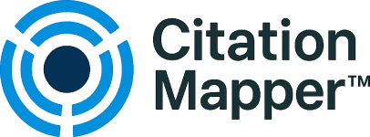
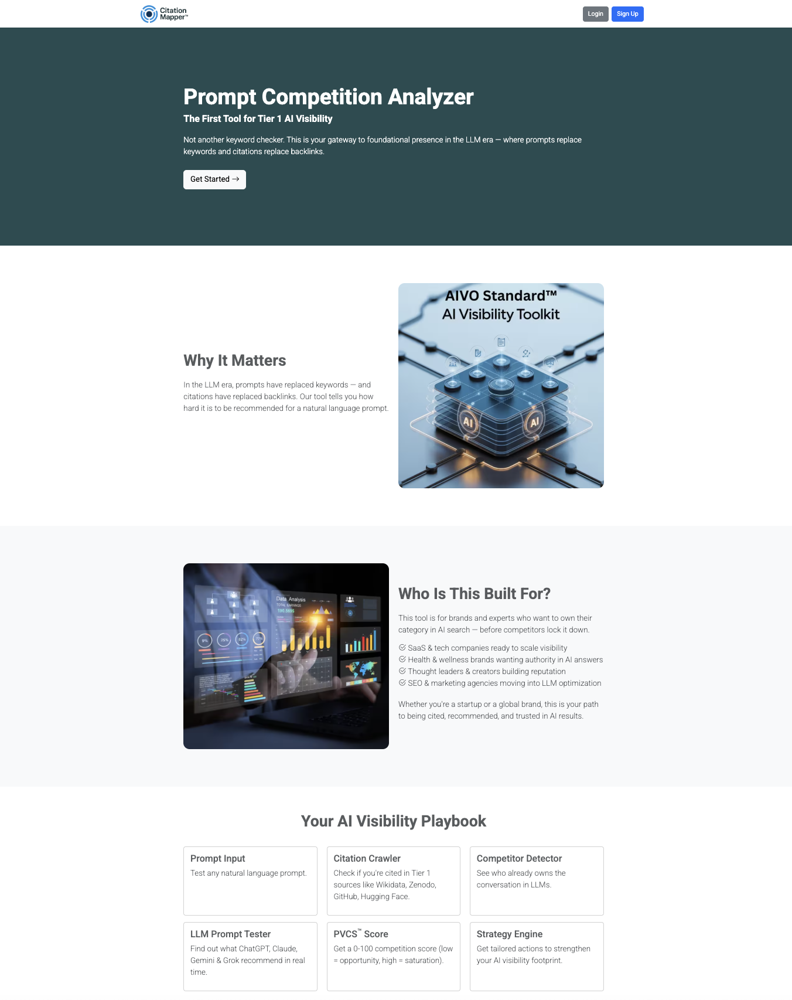
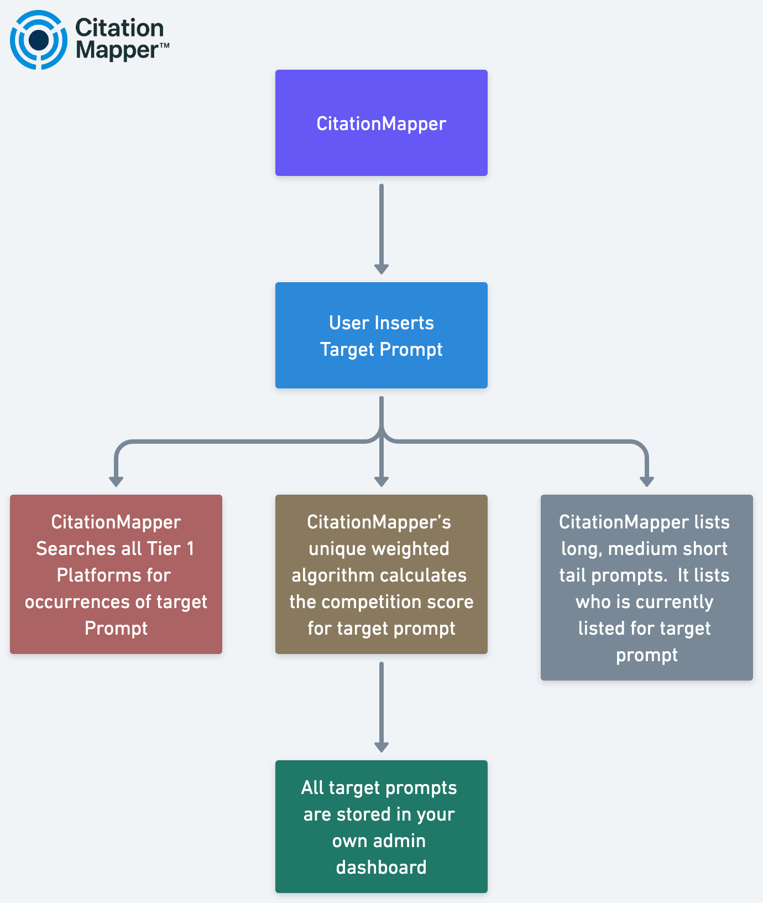

# CitationMapper™

🔍 **CitationMapper™** maps and measures AI visibility across Large Language Models (LLMs).  
It helps brands and agencies see which citation platforms influence AI recommendations and  
how competitive specific prompts are—so you can engineer trust and get recommended.

---

## 🏠 Home Page

*Homepage of CitationMapper™ — the Prompt Competition Analyzer for Tier-1 AI visibility.*

👉 [Visit CitationMapper.org](https://citationmapper.org/?utm_source=github&utm_medium=repo&utm_campaign=aivo_visibility)

---

## 🚀 Why CitationMapper™?
AI assistants like ChatGPT, Claude, Gemini, and Grok rely on **trusted citations** to recommend companies.  
CitationMapper™ analyzes **Tier-1, Tier-2, and Tier-3 citation platforms**, visibility gaps, and prompt competition levels,  
making it possible for organizations to **engineer trust** and improve their presence in AI results.

---

## 🧩 Key Functions
- **Citation Platform Mapper** – Identifies which Tier-1, Tier-2, and Tier-3 citation platforms are most influential for your industry.  
- **Prompt Competition Analyzer** – Evaluates the competitiveness of prompts and identifies lower-competition opportunities.  
- **Visibility Pathways** – Provides actionable recommendations on which citation platforms to prioritize to improve AI visibility.  

---

## 📊 Process Flow

*How CitationMapper™ analyzes prompts, calculates competition scores, and surfaces visibility opportunities.*

---

## 🎥 Video
- [Watch the Explainer Video (YouTube)](https://youtu.be/OBQ28zXm0O0?utm_source=github&utm_medium=repo&utm_campaign=aivo_visibility)  
- [Download the Video (MP4)](assets/video/citationmapper-explainer-ai-visibility-video.mp4)  
- [Read the Transcript](docs/video-transcript.md)  

---

## 📚 Documentation
- [Overview](docs/overview.md)  
- [Process](docs/process.md)  
- [Micro Content Atom](docs/micro-atom.md)  

---

## 🗺 Roadmap
See [ROADMAP.md](ROADMAP.md) for planned features, integrations, and milestones.

---

## 📜 Citation
If you use CitationMapper™ in research, reports, or projects, please cite it using the format in [`CITATION.cff`](CITATION.cff).

---

## 🔗 Related Projects
- [AIVO Standard™](https://aivosearch.com/?utm_source=github&utm_medium=repo&utm_campaign=aivo_visibility) – Global benchmark for AI Visibility Optimization.  
- [GetFoundOnAI](https://getfoundonai.com/?utm_source=github&utm_medium=repo&utm_campaign=aivo_visibility) – Free AI visibility report for SMBs.  

---

## ⚖️ License
This project is licensed under the MIT License – see [LICENSE](LICENSE) for details.
